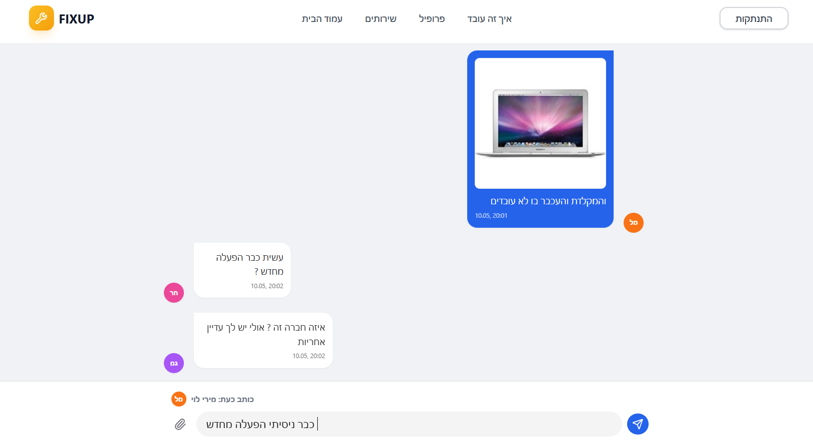
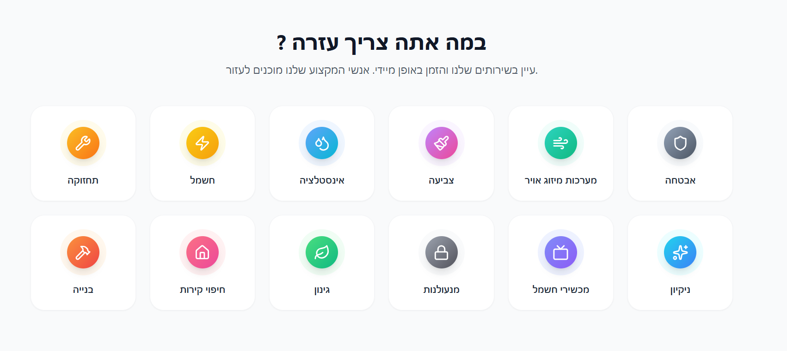
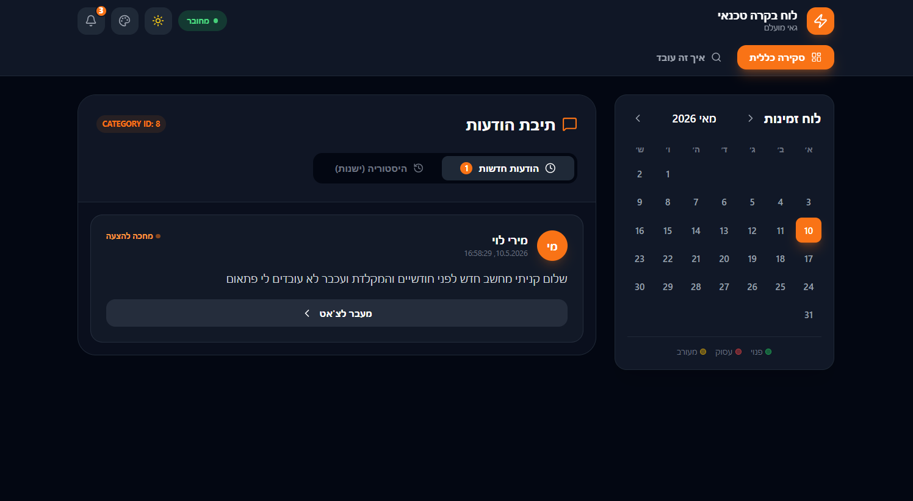

  

## FixUp - Real-Time Service Platform

FixUp is a production-like real-time service marketplace platform that connects customers with professional service
providers through smart issue classification, real-time communication, and automated routing.
The system enables users to report problems, attach images, and receive instant assistance from the most relevant professionals.

## 💡 Project Overview
FixUp is a smart service orchestration system designed to reduce the time between problem reporting and resolution.
Users can:
- Report technical or home-related issues
- Upload images for better diagnosis
- Chat in real time with professionals
- Get automatic issue classification
- Request professional visits
- Receive booking confirmations via email

# ✨ Features
## 💬 Real-Time Chat (SignalR)
- Instant messaging between users and professionals
- Live updates without page refresh
- Group-based conversation handling

---

## 📸 Image Upload System
- Upload images directly in chat
- Stored securely via backend API
- Displayed in real-time in conversation

---

## 🧠 Smart Issue Classification System
Custom rule-based multilingual keyword engine:

- Hebrew / English / Russian / Arabic support
- Category detection using predefined keyword dictionaries
- Automatic routing to relevant professionals
> Note: This system is rule-based (not AI), built using custom logic.

---
## 🧑‍🔧 Professional Routing System
- Automatic assignment based on category
- Real-time job notifications via SignalR
- Dedicated groups per category

---
## 📅 Professional Scheduling
- Availability calendar per professional
- Mark as busy / available
- Supports flexible scheduling

---

## 📧 Booking System
- Customers can request professional visits
- Email notifications sent on booking confirmation
- Minimum service duration support

---

## 🔐 Authentication & Authorization
- JWT-based authentication
- Role-based access control (Client / Professional)
- Secure protected routes

---

## 🧾 Chat History System
- Customers: session-based conversations
- Professionals: persistent chat history

## 🧱 Tech Stack

-
# 👥 Team Contribution
This project was developed collaboratively under a GitHub Organization.

---

###  TehillaZ

* **Real-time communication architecture using SignalR** for instant bi-directional messaging
* Robust message pipeline handling client-server synchronization, validation, and delivery flow
* End-to-end image processing and AI integration pipeline for automated request analysis and categorization
* Intelligent routing system for dynamic assignment of requests to relevant professionals based on classification logic
 

---

###  SaraAbaShaul

* **Booking System:** Designed and implemented the end-to-end appointment logic.
* Managed scheduling and professional availability.
* Integrated email service for automated confirmations.
* Ensured seamless backend workflow.
 

---

###  hadas0556751108-sudo

* **Backend Architecture:** Core system design using .NET Web API.
* Built layered system (Controllers / Services / Repository / Data Layer).
* Responsible for database schema and system organization.
 

### UI / Design
Base44 AI-assisted design tool
Implemented in React + Tailwind CSS

# 📸 Screenshots

  
  
   

